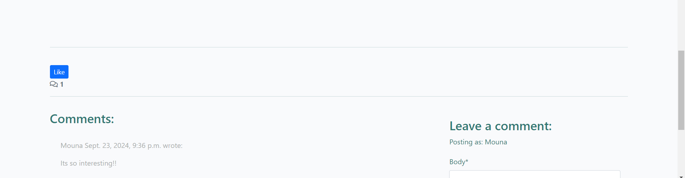

<h1>The Nomad's Blog</h1>
Nomad's Blog is a user-friendly travel blog platform designed to help users explore various travel stories and plan their vacations. Visitors can browse through a wide range of posts categorized by destination or travel type, and discover useful tips and advice for planning their next trip. Registered users can engage with others by commenting on posts, and they can also share their own travel experiences. It’s the perfect platform for both seasoned travelers and those looking for inspiration and advice.

<h1>Live Site</h1>
A live version of the site can be found <a href="https://the-nomad-s-blog-c3ceca4d0e99.herokuapp.com/" target="_blank">here</a>
<br>


<h1 id="contents">Contents</h1>

- [Introduction](#introduction)
 - [User Experience - UX](#user-experience)
   - [User Stories](#user-stories)
   - [Agile Methodology](#agile)
   - [The Scope](#the-scope)
- [Design](#design)
   - [Colours](#colours)
   - [Media](#media)
   - [Database](#database)

- [Features](#features)
   - [Homepage](#homepage)
   - [Navigation Desktop](#navigation-desktop)
   - [Navigation Mobile](#navigation-mobile)
- [Technologies](#technologies)
   
- [Development & Testing](#testing)
   - [Database](#database)
   - [Manual Tests](TESTING.md)
- [Deployment](#deployment)
    - [Deployment This Project](#deployment-this-project)
    - [Forking This Project](#forking-this-project)
    - [Cloning This Project](#cloning-this-project)
- [Credits](#credits)


<h1 id="introduction">Introduction</h1>

The Nomad's Blog is a full stack Django project that runs on Heroku.


<h1 id="user-experience">User Experience - UX</h1>

<a href="#top">Back to the top.</a>


<h2 id="user-stories">User Stories</h2>

* As a website user, I can:

1. View a paginated list of posts so that I can easily browse and choose which post to read.
2. Click on a post to read the full text.
3. Create and register an account so that I can comment on posts and Like the Posts.
4. View comments on individual posts to read the ongoing conversation.
5. Click on the About link to learn more about the site.
6. Choose between different categories to view posts in the category that interests me the most.

* As an authenticated website user, I can:

1. Comment on a post to share my thoughts and engage in a conversation.
2. Modify or delete my own comments.
3. View comments on individual posts to follow the conversation.
4. Write and publish my own travel blog stories.

* As a website superuser, I can:

1. View comments on individual posts.
2. Create draft posts so that I can finish writing content later.
3. Create or update the About page content so that it is available on the site.
4. Create, read, update, and delete posts.
5. Approve or disapprove comments to filter out inappropriate or offensive content.


<h2 id="agile">Agile Methodology</h2>

The Agile Methodology was used to plan this project. This was implemented through Github and the Project Board which can be seen here -  <a href=" " target="blank">The Nomad's Blog User Stories</a>


<h2 id="the-scope">The Scope</h2>

1. User-Friendly Design: Provide users with a simple, easy-to-navigate, and visually pleasing platform that enhances their browsing experience.

2. Post Travel Stories: Allow users to create and share their travel stories by posting blog entries with text and images.

3. Interactive Features: Enable users to interact with the platform by commenting, liking, and sharing posts to promote engagement.

4. Community Engagement: Foster a community where both registered and anonymous users can express appreciation through likes and shares, while registered users can post comments.

<h1 id="design">Design</h1>

<a href="#top">Back to the top.</a>

<h2 id="colours">Colours</h2>

The color palette of Nomad's Blog predominantly features various shades of green, reflecting the project's commitment to celebrating nature and promoting a sense of peacefulness. Each hue is carefully selected to evoke feelings of tranquility and harmony, symbolizing our dedication to environmental awareness and the beauty of the natural world. This design choice not only enhances the aesthetic appeal of the blog but also aligns with our mission to inspire wanderlust and appreciation for the great outdoors. The colors are  #rgb(34, 192, 118), #445261, #17c9a0, #188181.

<h2 id="media">Media</h2>

* All photographs used on the blog are from<a href="https://www.pexels.com/" target="_blank"> Pexels.com </a>

<h1 id="features">Features</h1>

<a href="#top">Back to the top.</a>


<h2 id="homepage">Homepage</h2>

* It is the landing page of the website which user can see first when the site loads. The homepage displays the latest 6 posts.


<h2 id="navigation-desktop">Navigation Desktop</h2>

<a href="#top">Back to the top.</a>

* The site navigation is done through the navigation bar at the top of each page & this is consistant throughout the website.

* The navigation bar at the top of each page is sticky to allow access to the navigation at any time.

* Options on the navigation bar change depending on whether the user is logged in or not, or is an admin/staffuser or not.


<h2 id="post-details">Posts Details</h2>


<h2 id="Likes">Likes</h2>

The Like Posts feature has been introduced for registered users. Upon logging in, users can express their appreciation for their favorite posts by liking them.

When a user likes a post, the displayed number of likes is updated and increased by one. Additionally, users have the option to click the like button again to remove their like, which subsequently decreases the count.

This functionality effectively demonstrates CRED operations (Create, Read, Update, Delete) on the website, enhancing user engagement and interaction with the content.




<a href="#top">Back to the top.</a>

* When a regular user is visiting they can view and read a post onthe post detail page.

* When an authenticated user is logged in they can also comment on a post.

* If a comment is submitted this will have to be approved by an Admin user before it is displayed on the site.

<a href="#top">Back to the top.</a>

<h2 id="categories">Categories</h2>

* To see categories for posts click the Category menu in the navbar and click on selected category in a dropdown menu. All post belonging to chosen category will be displayed.


<h2 id="admin-backend">Admin on the Backend</h2>

* Superusers or staffusers are able to managae the posts and categories on the backend.


<h2 id="future-features">Possible Future Features</h2>

<a href="#top">Back to the top.</a>

* <h3>Geolocation Integration:</h3> Enable users to tag their stories with locations on a map, allowing visitors to explore stories by geographic area.

* <h3>Search Functionality:</h3> Implement a robust search feature that lets users find stories based on keywords, categories, or locations.

* <h3>User Notifications:</h3> Notify users when someone comments on their posts, likes their stories, or follows them.

<h1 id="technologies">Technologies</h1>

<a href="#top">Back to the top.</a>

<h2 id="languages">Languages Used</h2>

* [HTML 5](https://en.wikipedia.org/wiki/HTML/)
* [CSS 3](https://en.wikipedia.org/wiki/CSS)
* [JavaScript](https://www.javascript.com/)
* [Django](https://www.python.org/)
* [Python](https://www.djangoproject.com/)

<h2 id="django-packages">Django Packages Used</h2>

* [Gunicorn](https://gunicorn.org/)<br>
   As the server for Heroku
* [Cloudinary](https://cloudinary.com/)<br>
   Was used to host the static files and media
* [Dj_database_url](https://pypi.org/project/dj-database-url/)<br>
   To parse the database URL from the environment variables in Heroku
* [Psycopg2](https://pypi.org/project/psycopg2/)<br>
   As an adaptor for Python and PostgreSQL databases
* [Summernote](https://summernote.org/)<br>
   As a text editor
* [Allauth](https://django-allauth.readthedocs.io/en/latest/installation.html)<br>
   For authentication, registration, account
   management
* [Crispy Forms](https://django-crispy-forms.readthedocs.io/en/latest/)<br>
   To style the forms
* [Whitenoise](http://whitenoise.evans.io/en/stable/)<br>
   For static CSS on Heroku

<h2 id="frameworks">Frameworks - Libraries - Programs Used</h2>

* [Bootstrap](https://getbootstrap.com/)<br>
   
* [Jquery](https://jquery.com/)<br>
   
* [Git](https://git-scm.com/)<br>
   
* [GitHub](https://github.com/)<br>
   
* [Heroku](https://id.heroku.com)<br>
   
* [ElephantSQL](https://www.elephantsql.com/)<br>
   
* [VSCode](https://code.visualstudio.com/)<br>
  
* [Fontawesome](https://fontawesome.com/)<br>
   
* [Google Chrome Dev Tools](https://developer.chrome.com/docs/devtools/)<br>


<h1 id="testing">Development & Testing</h1>

<a href="#top">Back to the top.</a>


<h2 id="testing-results">Manual Testing Results</h2>

* Manual Testing results 

* [PEP8](http://pep8online.com/)<br>
   PEP8 was used to validate all the Python code:
   - bugs detected in some files (models.py)
   

    - 


* All files in about, my_project and apps came back clear except settings.py where's 1 line too long. It's in ALLOWED_HOSTS and cannot be shortend.
   

* [W3C - HTML](https://validator.w3.org/)<br>
   W3C- HTML was used to validate all the HTML code
   
* [W3C - CSS](https://jigsaw.w3.org/css-validator/)<br>
   W3C - CSS was used to validate the CSS code
   
  
  * The Login and Logout system is working correctly. It shows the right interactive message to the users on Login and Logout.

  ## Login


## CRUD
   * Full CRUD functionality is present. Users can view (Read) posts on the page, and once registered and logged in they can comment on a post (Create), update their posts (Update) and delete their posts (Delete) if they wish.


<h1 id="deployment">Deployment</h1>

<a href="#top">Back to the top.</a>


## Heroku

The project was deployed via <a href="https://id.heroku.com/login" target="_blank">Heroku</a>, and the live link can be found here: <a href=" " target="_blank">The Nomad's Blog</a>

This project was developed utilising the <a href="https://github.com/Code-Institute-Org/gitpod-full-template" target="_blank">Code Institute Template for Gitpod</a>.

Before deploying to Heroku pip3 freeze > requirements.txt was used to add all dependencies for deployment and created the Procfile with web: gunicorn cocktailnerd.wsgi.

Created .slugignore with /documentation, README.md & TESTING.md as paths to ignore in Heroku as I don't want the documentation to upload to Heroku.

This project was deployed to Heroku using the Heroku CLI details below

* Login
To use the CLI you must log in to your Heroku account. To do this you will need to
enter the command heroku login -i in the terminal. It requires the email and
password you used to sign up. If you have enabled multi-factor authentication (a
recommended security practice) then instead of your password you need an API key.
To get the API key go to your account settings and scroll down to the section ‘API
Key’. Click reveal and copy that, then paste it into the password prompt.

* Creating A Heroku App
Now that you are logged in, the first thing is to create a new app. Heroku creates a
URL based on your app name, so it must be unique not only on your account, but
across the whole site. You may need to try a few different names. To create an app
use the following command, where myapp is the name of your app.

* Here the app heroku-cli-example has been created with an output of the website
URL. It also displays and sets the git remote repository which will be used to deploy.
By default the region will be set to the US. If you would prefer a server based in the
EU then you can specify the region with the flag EU

* When you push code to Heroku it will look at the repository contents to decide how
to build the project. One of the factors taken into consideration is the package file.
With a Python project the standard file is a requirements.txt file, which will have the
list of packages needed to run the project. If this file is present it will build the project
using the Python buildpack.

* It is also possible to specify the buildpack manually. More information about
buildpacks can be found in the documentation. To check the buildpack for the
project you can enter heroku buildpacks in the terminal.

## Deployment Steps On Heroku.

* Run this command pip3 install pip3 install 'django<4' to install django.
* Added these libraries:pip3 install dj_database_url psycopg2,pip3 install dj3-cloudinary-storage
* Created requirements.txt file where I can save all the libraries I've installed:pip3 freeze --local > requirements.txt
* To create my project typed this command:django-admin startproject cocktailnerd
* To create my app:python3 manage.py startapp cocktailapp
* To make this app work, Into the setting.py file inside INSTALLED_APPS added cocktailapp
* To migrate changes typed this command:python3 manage.py migrate
* To run the test if the project is working python3 manage.py runserver
* When deploying for the first time on Heroku, you must first register with Heroku.
* Create your project name and location.
* To add Database into the app, Locate in the Resources Tab, Add-ons, search and add 'Heroku Postgres'
* Copy DATABASE_URL value, by going into the Settings Tab, click reveal Config Vars, Copy Text
* In your workspace Create new env.py file.
* Import os library:import os
* Set environment variables:os.environ["DATABASE_URL"] = "Heroku DATABASE_URL"
* Add in secret key:os.environ["SECRET_KEY"] = "mysecretkey"
* Add Secret Key to Config Vars in Heroku settings:SECRET_KEY, "mysecretkey"
* Add env.py file to the settings.py file:import osimport dj_database_urlif os.path.isfile("env.py"):import env
* Remove the insecure secret key and replace - links to the SECRET_KEY variable on Heroku:SECRET_KEY = os.environ.get('SECRET_KEY')
* Comment out the old DATABASES variable in setting.py file and add this instead:DATABASES = { 'default': dj_database_url.parse(os.environ.get("DATABASE_URL"))}
* Save all files and Make Migrations:python3 manage.py migrate
* Make account with Cloudinary To get static and media files.
* From Cloudinary Dashboard, Copy your CLOUDINARY_URL:
* Add Cloudinary URL to env.py file:os.environ["CLOUDINARY_URL"] = "cloudinary://************************"
* Add Cloudinary URL to Heroku Config Vars:"cloudinary://************************"
* Temporalliy add DISABLE_COLLECTSTATIC inside the heroku config Vars:DISABLE_COLLECTSTATIC, 1
* Add Cloudinary Libraries to settings.py installed apps:INSTALLED_APPS = ['cloudinary_storage', 'django.contrib.staticfiles', 'cloudinary']
* In the settings.py file under the STATIC_URL = 'static/' add:

```python
STATICFILES_STORAGE = 'cloudinary_storage.storage.StaticHashedCloudinaryStorage'
STATICFILES_DIRS = [os.path.join(BASE_DIR, 'static'), ]
STATIC_ROOT = os.path.join(BASE_DIR, 'staticfiles')

```
* Place under the BASE_DIR line in settings.py:TEMPLATES_DIR = os.path.join(BASE_DIR, 'templates')
* Change the templates directory to TEMPLATES_DIR Place within the TEMPLATES array:TEMPLATES = [{'DIRS': [TEMPLATES_DIR],}]
* Add Heroku Hostname to ALLOWED_HOSTS:ALLOWED_HOSTS = ["project4-cocktail-nerd.herokuapp.com", "localhost"]
* Create 3 new folders on the root directory: media, static, templates
* Create Procfile needed for Heroku on the root directory and inside the file add this:web: gunicorn dentist.wsgi
* Before deploying on heroku make sure: DEBUG = False Remove DISABLE_COLLECTSTATIC from the config vars.
* Created .slugignore with /documentation, README.md & TESTING.md as I don't want the documentation to upload to Heroku.
* Click **Enable Automatic Deploys** for automatic deployment when you push updates to Github.
* Select the correct branch for deployment from the drop-down menu and click **Deploy Branch** for manual deployment.


## Forking This Project

* Fork this project following the steps:

1. Open [GitHub](https://github.com/).
2. Click on the project to be forked.
3. Find the 'Fork' button to the top right of the page.
4. Once you click the button the fork will be in your repository..


## Cloning This Project

* Clone this project following the steps:

1. Open [GitHub](https://github.com/).
2. Click on the project to be cloned.
3. You will be provided with three options to choose from, HTTPS, SSH or GitHub CLI, click the clipboard icon in order to copy the URL..
4. Once you click the button the fork will be in your repository.
5. Open a new terminal.
6. Change the current working directory to the location that you want the cloned directory.
7. Type 'git clone' and paste the URL copied in step 3.
8. Press 'Enter' and the project is cloned.


### Github Desktop
<ol>
    <li>Log in to your GitHub account</li>
    <li>Navigate to the Repository <a href=" " target="_blank"><strong>HERE</strong></a></li>
    <li>Select the 'Code' button above the file list on the right had side</li>
    <li>Select 'Open with GitHub Desktop'</li>
    <li>If you haven't already installed GitHub desktop application - you will need to follow the relevant steps to do this</li>
    <li>The repo will then be copied locally onto your machine</li>
</ol>

### Download and extract the zip directly from GitHub
<ol>
    <li>Log in to your GitHub account</li>
    <li>Navigate to the Repository <a href=" " target="_blank"><strong>HERE</strong></a></li>
    <li>Select the 'Code' button above the file list on the right had side</li>
    <li>Select 'Download Zip'</li>
    <li>Once you have the Zip downloaded, open it with your prefered file decompression software</li>
    <li>You can then drag and drop the files from the folder into your chosen IDE or view/edit them on your local machine</li>
    <li>If you want to create a web-app from the repo please follow the instructions in "Project Deployment"</li>
</ol>

<h1 id="credits">Credits</h1>

<a href="#top">Back to the top.</a>

* Code Institute "I think therefore I blog" walkthrough helped me understand and setup the base code for The Nomad's blog.

* Posts are from various platforms.

* Images used on the website are from <a href="https://pexels.com/" target="_blank"><strong>Pexels:</strong></a>

* Structure of this README.md file was inspired by former <a href="https://github.com/madeleine2086/pp4" target="_blank">Code Institute student's</a> README.md, which is the best, most detailed README file I have seen so far. Thank you to Mandeline for making it available to other students.

### Other resources

* [Stack Overflow](https://stackoverflow.com/)
* [Chatgpt](https://openai.com/chatgpt/)
* [Youtube Video](www.youtube.com/@the_proton_guy)
* [Youtube Video](codemy.com)


